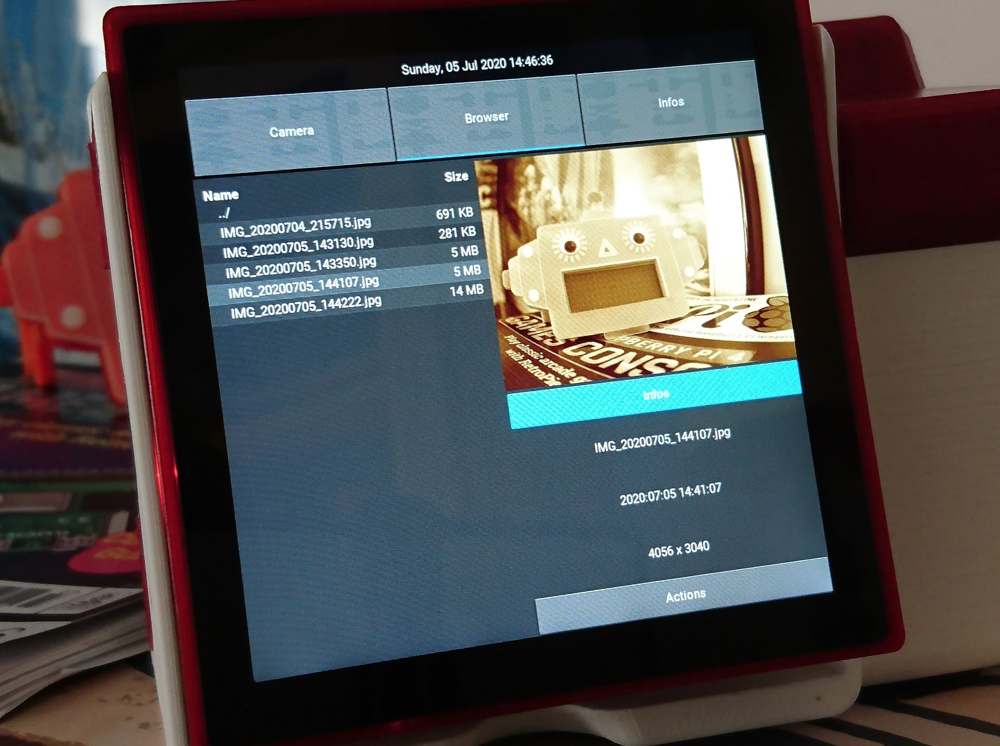
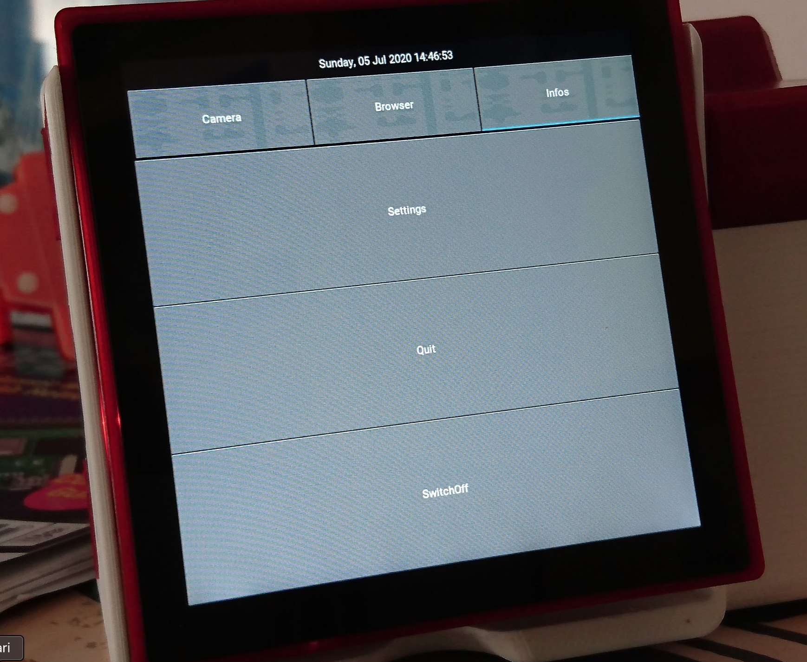
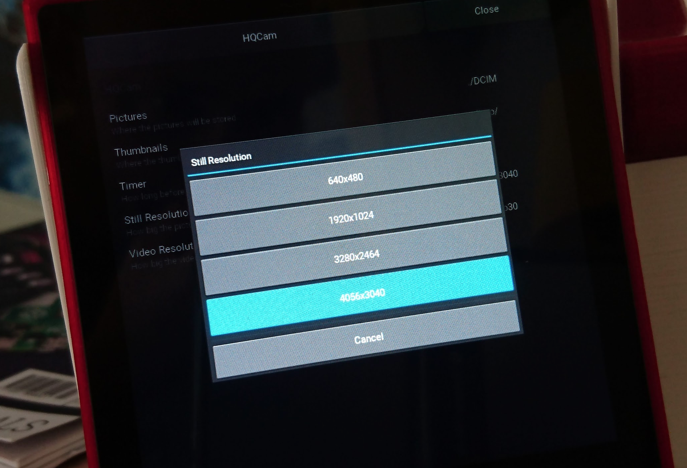

# PiHQCam Software & Usage

To complete the experience of a fully integrated Raspberry Pi powered camera, a full application had to be designed.

This document sums up the required installation instructions.

## System base setup

### Operating System Preparation

The system relies on a clean installation of the Raspberry Pi OS - "Buster". Once the SD card is prepared with the base operating system, it can be completed to ease the network access of the Pi.

The following actions have to be done on the _boot_ partition of the SD card, from a command-line terminal.

 - Enable SSH remote access:
```
touch ssh
```
 - Create the Wi-Fi configuration file:
```
nano wpa_supplicant.conf
```
 - Add the appropriate connection details (SSID / passphrase / country):
```
ctrl_interface=DIR=/var/run/wpa_supplicant GROUP=netdev
update_config=1
country=FR

network={
	ssid="MY-WIFI-NETWORK-SSID"
	psk="MY-WIFI-NETWORK-PASSPHRASE"
	key_mgmt=WPA-PSK
}
```
The SD card can now be removed and inserted in the camera.

### Operating System Configuration

Once inserted and the Pi powered up:
 - Connect via SSH to the Pi:
 ```
 ssh pi@raspberrypi.local
 ```

- Update the application and OS to the latest version:
 ```
sudo apt-get update
sudo apt-get -y full-upgrade
 ```
 - Add some useful tools:
 ```
sudo apt-get install -y vim git screen
 ```
 - Configure the system's elements with the following command:
   - Hostname : ```picamera```
   - Pi user password : ```To_your_liking_:D```
   - Interface :
     - PiCamera : ```Activate```
     - I2C : ```Activate```
   - Advanced Options:
     - Memory Split : ```256```
   - ___BUT DO NOT REBOOT___ just yet the Raspberry Pi after the configuration.
 ```
sudo raspi-config
 ```

### Pimoroni Components Configurations
 - Install the library for the HyperPixel 4 Square screen:
 ```
curl https://get.pimoroni.com/hyperpixel4 | bash
 ```
 - Modify the _/boot/config.txt_ file:
 ```
sudo nano /boon/config.txt
 ```
 - Add the following at the end of the file to turnoff the screen at shutdown:
 ```
 # Turn off the Hyperpixel Screen when shutting down
dtoverlay=gpio-poweroff,gpiopin=19,active_low=1
 ```
 - Install some Python libraries :
 ```
sudo apt-get install -y python3-pip python3-setuptools python3-dev python3-rpi.gpio python3-picamera 
python3 -m pip install --upgrade --user Cython==0.29.10 pillow
 ```
  - Install the latest GIT based Pimoroni Trackball library :
 ```
cd ~/Pimoroni
git clone https://github.com/pimoroni/trackball-python`
cd trackball-python
sudo ./install.sh
 ```
  - Do a full reboot of the Raspberry Pi :
 ```
sudo reboot
 ```
   - Once the Pi has rebooted, connect back to it over SSH to try the trackball example to ensure that it is properly connected to the Hyperpixel I2C connector :
 ```
sudo ln -s /dev/i2c-3 /dev/i2c-1
cd ~/Pimoroni/trackball-python/examples
python3 rainbow.py 
 ```

## Camera Project setup

 - Install the necessary libraries and software :
 ```
sudo apt install -y libsdl2-dev libsdl2-image-dev libsdl2-mixer-dev libsdl2-ttf-dev pkg-config libgl1-mesa-dev libgles2-mesa-dev libgstreamer1.0-dev git-core gstreamer1.0-plugins-{bad,base,good,ugly} gstreamer1.0-{omx,alsa} libmtdev-dev xclip xsel libjpeg-dev
 ```
 - Retrieve project :
 ```
cd ~
git clone https://github.com/pierreyvesbaloche/PiHQCam.git
cd PiHQCam
 ```
 - Create an initial directory to hold the medias :
 ```
mkdir DCIM
 ```
 - Install the project's requirements :
 ```
pip3 install -r requirements.txt
 ```
 - Edit the Kivy configuration file :
 ```
nano ~/.kivy/config.ini
 ```
 - Replace the [input] section with the following configuration :
 ```
# Get the touchscreen to work with Kivy
[input]
mouse = mouse
mtdev_%(name)s = probesysfs,provider=mtdev
hid_%(name)s = probesysfs,provider=hidinput

# Review the calibration
[postproc:calibration]
(mtdev) = xoffset=1,yoffset=1,xratio=-1,yratio=-1
 ```
 - Test the project's camera software
 ```
export PYTHONPATH=.
python3 pihqcam/main.py
 ```
 - Once the initial testing done, exit the application (Scroll to the far-right tab with the trackball then press the ___Quit___ button)
 - Activate the auto-startup service :
 ```
sudo cp etc/picamera.service /etc/systemd/system/
sudo systemctl enable picamera.service
sudo systemctl start picamera.service
sudo systemctl stop picamera.service
 ```

 ## Usage tips

The interface is organised between panels, all allowing access to different settings & usage.

Three main functionalities are represented by tabs on top of the screen:
- __Camera__ : Direct view from the camera
- __Browser__ : File access to medias
- __Info__ : Access to information & configuration

__Important__ : As the switch between tabs under Kivy is not working with the Hyperpixel touchscreen, the trackball allows you to switch between them when rolling left to right.

 ### Camera Tab


 The ___Camera___ interface providing direct view for the camera when not capturing/filming.

 Three buttons at its bottom allows you to choose between the modes available:
  - __Camera__ : Take a single shot right-away, when pressing once the trackball's button.
  - __Timer__ : Trigger a timer before taking the shot whose duration is configurable.
  - __Video__ : Film with the camera when starting and stopping the sequence by pressing once the trackball.

The side of the screen also integrates pannels that you can press on on the screen to reveal the set of available effects with the camera.
Some of them are compatible with the direct view whereas others are not, so don't be surprised.

 ### Browser Tab



The ___Browser___ tab points to the location configured (DCIM by default) where all the medias (pictures and videos) are stored. You can scroll between them with the up & down rolls of the trackball which will update the preview of the media on the right hand side.

Under the preview, some basic information are available like the name, date & time & resolution in the *Info* panel. 

You can also perform some actions when revealing the action panel. Currently, only the *delete* option is available but additional features will come after.

 ### Info Tab



The ___Info___ tab allows you to reach the Settings of the application, as well as either quitting the application or even shutting down completly the camera, so that you'll be able to unplug the camera.

You can define the following parameters:
 - __Picture__ : where the medias are to be stored
 - __Thumbnails__ : where the thumbnails of the medias will be generated & stored
 - __Timer__ : how long the timer should last
 - __Still Resolution__ : the resolution to be used for the *camera* & *timer* modes
 - __Video Resolution__ : the resolution to be used for the *video* mode



__Important__ : Again the Kivy interface can be a bit tricky when selecting / entering values, it might be necessary to insit when selecting/confirming choices. *Sliding slighly* can be helping sometimes as you press the screen's choice. For manual entries (paths, duration...) a touchscreen keyboard will popup.