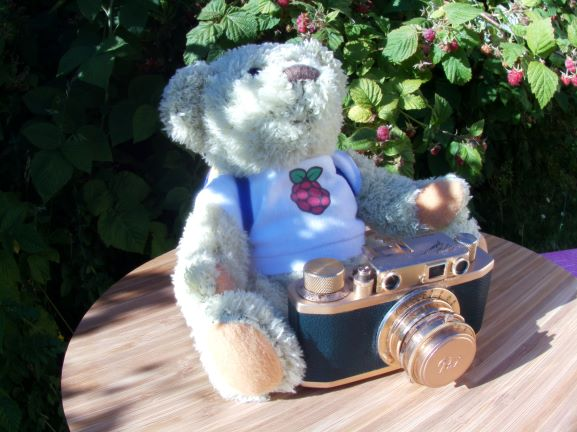

# PiHQCam
*" A full self-contained Raspberry Pi Camera Project. "*

This picture of Babbage Bear posing in front of some Raspberries was the very first one taken from this incredible project.

Make sure to follow this project as its content will soon get updated with all necessary items :
  - 3D Model files ( https://www.thingiverse.com/thing:4425806 )
  - Project's code & short configuration procedure ( https://github.com/pierreyvesbaloche/PiHQCam/blob/master/INSTALL.md )

Also, the story of this project is available to read if you have some spare time :
 - Part 1 : " *PiHQCam — The story behind* " ( https://medium.com/@baloche.pierreyves/pihqcam-the-story-behind-4c0a394821f6 )
 - Part 2 : " *PiHQCam - Designing a full Raspberry Pi Camera enclosure* " ( https://medium.com/@baloche.pierreyves/pihqcam-designing-a-full-raspberry-pi-camera-enclosure-56306b41b56f )
   - with 3D rendering video : https://www.youtube.com/watch?v=bUC98WaIeWQ

If you feel that there would be some improvements that you'd like to see, make sure to raise an issue and I'll get them sorted as soon as possible.

Have fun and don't hesitate to share your own projects !
